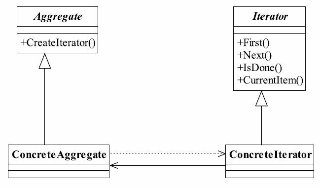

# 迭代器模式

## 迭代器模式的定义
迭代器模式（Iterator Pattern）目前已经是一个没落的模式，基本上没人会单独写一个迭代器，除非是产品性质的开发，其定义如下：
Provide a way to access the elements of an aggregate object sequentially without exposing its underlying representation.（它提供一种方法访问一个容器对象中各个元素，而又不需暴露该对象的内部细节。）



## 迭代器模式中的各个角色
● `Iterator`抽象迭代器
抽象迭代器负责定义访问和遍历元素的接口，而且基本上是有固定的3个方法：

`first()`获得第一个元素，

`next()`访问下一个元素，

`isDone()`是否已经访问到底部（Java叫做hasNext()方法)
● ConcreteIterator具体迭代器
具体迭代器角色要实现迭代器接口，完成容器元素的遍历。

● Aggregate抽象容器
容器角色负责提供创建具体迭代器角色的接口，必然提供一个类似createIterator()这样的方法，在Java中一般是iterator()方法。
● Concrete Aggregate具体容器
具体容器实现容器接口定义的方法，创建出容纳迭代器的对象。

## ` Iterator`抽象迭代器`Iterator.java`

```java
public interface Iterator<T> {
    boolean hasNext();
    T next();
}
```

## ConcreteIterator具体迭代器

### 菜单实体类`MenuItem.java`

```java
@Data
@AllArgsConstructor
public class MenuItem {
    private String name,desc;
    private float price;
    private boolean vegetable;
}
```

### `CakeShopMenu.java`

```java
public class CakeShopMenu {
    ArrayList<MenuItem> list = new ArrayList<>();

    public CakeShopMenu() {
        list.add(new MenuItem("sandwich", "三明治", 4.5f, true));
        list.add(new MenuItem("sausage", "热狗", 2.5f, true));
        list.add(new MenuItem("cake", "蛋糕", 10f, true));
    }

    public ArrayList<MenuItem> getMenuItem() {
        return this.list;
    }

    public CakeShopMenuIterator getIterator() {
        return new CakeShopMenuIterator();
    }

    private class CakeShopMenuIterator implements Iterator {
        int size = 0;

        public CakeShopMenuIterator() {
            size = list.size();
        }

        @Override
        public boolean hasNext() {
            if (size > 0) {
                return true;
            }
            return false;
        }

        @Override
        public MenuItem next() {
            size--;
            return list.get(size);
        }
    }
}
```

### `WestRestaurantMenu.java`

```java
public class WestRestaurantMenu {
    private static final int MAX_MENU_NUMBERS = 5;
    MenuItem[] array = new MenuItem[MAX_MENU_NUMBERS];

    public WestRestaurantMenu() {
        array[0]=new MenuItem("pepper steak","黑椒牛排",70f,false);
        array[1]=new MenuItem("filet steak","腓力牛排",120f,false);
        array[2]=new MenuItem("sirloin steaks","西冷牛排",82f,false);
        array[3]=new MenuItem("fried chicken wings","炸鸡翅",24f,false);
        array[4]=new MenuItem("Big Mac","巨无霸",24f,false);
    }
    public  MenuItem[] getMenuItem() {
        return this.array;
    }
    public WestRestaurantMenuIterator getIterator() {
        return new WestRestaurantMenuIterator();
    }

    private class WestRestaurantMenuIterator implements Iterator {
        int size = 0;

        public WestRestaurantMenuIterator() {
            size = array.length;
        }

        @Override
        public boolean hasNext() {
            if (size > 0) {
                return true;
            }
            return false;
        }

        @Override
        public MenuItem next() {
            size--;
            return array[size];
        }
    }
}
```

### 菜单测试类`MenuItemTest.java`

```java
public class MenuItemTest {
    public static void main(String[] args) {
        CakeShopMenu cakeShopMenu = new CakeShopMenu();
        WestRestaurantMenu westRestaurantMenu = new WestRestaurantMenu();
        List<Iterator<MenuItem>> list = Arrays.asList(cakeShopMenu.getIterator(), westRestaurantMenu.getIterator());
        list.forEach(iterator -> {
            while (iterator.hasNext()) {
                MenuItem menuItem = iterator.next();
                System.out.println("菜单：" + menuItem.getName() + " 菜单描述：" + menuItem.getDesc() +
                        " 菜单价格：" + menuItem.getPrice() + " 是否素食：" + menuItem.isVegetable());
            }
        });
    }
}
```

输出：

```cmd
菜单：cake 菜单描述：蛋糕 菜单价格：10.0 是否素食：true
菜单：sausage 菜单描述：热狗 菜单价格：2.5 是否素食：true
菜单：sandwich 菜单描述：三明治 菜单价格：4.5 是否素食：true
菜单：Big Mac 菜单描述：巨无霸 菜单价格：24.0 是否素食：false
菜单：fried chicken wings 菜单描述：炸鸡翅 菜单价格：24.0 是否素食：false
菜单：sirloin steaks 菜单描述：西冷牛排 菜单价格：82.0 是否素食：false
菜单：filet steak 菜单描述：腓力牛排 菜单价格：120.0 是否素食：false
菜单：pepper steak 菜单描述：黑椒牛排 菜单价格：70.0 是否素食：false
```

## 迭代器模式的应用

从JDK 1.2版本开始增加java.util.Iterator这个接口，并逐步把Iterator应用到各个聚集类（Collection）中，我们来看JDK 1.5的API帮助文件，你会看到有一个叫java.util.Iterable的接口，看看有多少个接口继承了它：
BeanContext

BeanContextServices

BlockingQueue<E>

Collection<E>

List<E>

Queue<E>

Set<E>

SortedSet<E>
再看看有它多少个实现类：
AbstractCollection

AbstractList

AbstractQueue

AbstractSequentialList

AbstractSet

ArrayBlockingQueue

ArrayList

AttributeList

BeanContextServicesSupport

BeanContextSupport

ConcurrentLinkedQueue

CopyOnWriteArrayList

CopyOnWriteArraySet

DelayQueue

EnumSet

HashSet

JobStateReasons

LinkedBlockingQueue

LinkedHashSet

LinkedList

PriorityBlockingQueue

PriorityQueue

RoleList

RoleUnresolvedList

Stack

SynchronousQueue

TreeSet

Vector
基本上我们经常使用的类都在这个表中了，也正是因为Java把迭代器模式已经融入到基本API中了，我们才能如此轻松、便捷。
我们再来看看Iterable接口。java.util.Iterable接口只有一个方法：iterator()，也就说，通过iterator()这个方法去遍历聚集类中的所有方法或属性，基本上现在所有的高级语言都有Iterator这个接口或者实现，Java已经把迭代器给我们准备好了，我们再去写迭代器，就有点多余了。所以呀，这个迭代器模式也有点没落了，基本上很少有项目再独立写迭代器了，直接使用Collection下的实现类就可以完美地解决问题。

## 最佳实践
如果你是做Java开发，尽量不要自己写迭代器模式！省省吧，使用Java提供的Iterator一般就能满足你的要求了。