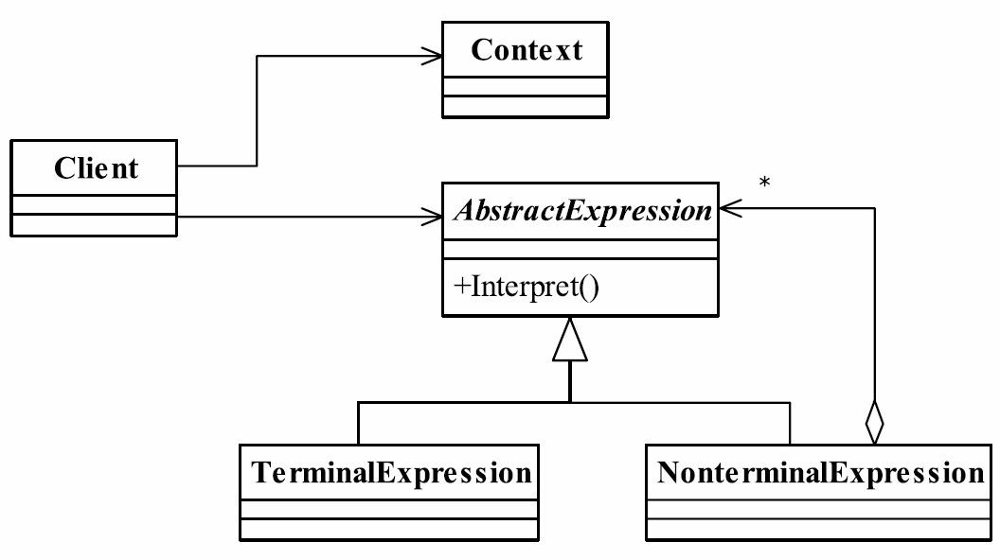

# 19.解释器模式

## 解释器模式的定义
解释器模式（Interpreter Pattern）是一种按照规定语法进行解析的方案，在现在项目中使用较少，其定义如下：Given a language, define a representation for its grammar along with an interpreter that uses the representation to interpret sentences in the language.（给定一门语言，定义它的文法的一种表示，并定义一个解释器，该解释器使用该表示来解释语言中的句子。）



## 解释器模式的角色

● AbstractExpression——抽象解释器
具体的解释任务由各个实现类完成，具体的解释器分别由TerminalExpression和Non-terminalExpression完成。
● TerminalExpression——终结符表达式
实现与文法中的元素相关联的解释操作，通常一个解释器模式中只有一个终结符表达式，但有多个实例，对应不同的终结符。具体到我们例子就是VarExpression类，表达式中的每个终结符都在栈中产生了一个VarExpression对象。
● NonterminalExpression——非终结符表达式
文法中的每条规则对应于一个非终结表达式，具体到我们的例子就是加减法规则分别对应到AddExpression和SubExpression两个类。非终结符表达式根据逻辑的复杂程度而增加，原则上每个文法规则都对应一个非终结符表达式。
● Context——环境角色
具体到我们的例子中是采用HashMap代替。

## 实例

### 抽象解释器`AbstractExpression.java`

抽象表达式是生成语法集合（也叫做语法树）的关键，每个语法集合完成指定语法解析任务，它是通过递归调用的方式，最终由最小的语法单元进行解析完成。

```java
public abstract class AbstractExpression {
    protected abstract Float interpreter(HashMap<String,Float> map);
}
```

### 终结符表达式`VarExpression.java`

通常，终结符表达式比较简单，主要是处理场景元素和数据的转换。

```java
public class VarExpression extends AbstractExpression {
    private String key;
    public VarExpression(String key) {
        this.key=key;
    }

    @Override
    protected Float interpreter(HashMap<String,Float> map) {
        return map.get(this.key);
    }
}
```

### 非终结符表达式

每个非终结符表达式都代表了一个文法规则，并且每个文法规则都只关心自己周边的文法规则的结果（注意是结果），因此这就产生了每个非终结符表达式调用自己周边的非终结符表达式，然后最终、最小的文法规则就是终结符表达式，终结符表达式的概念就是如此，不能够再参与比自己更小的文法运算了。

#### `SymbolExpression.java`

```java
public abstract class SymbolExpression extends AbstractExpression {
    protected AbstractExpression left;
    protected AbstractExpression right;

    public SymbolExpression(AbstractExpression left, AbstractExpression right) {
        this.left = left;
        this.right = right;
    }
}
```

#### `AddExpression.java`

```java
public class AddExpression extends SymbolExpression {
    public AddExpression(AbstractExpression left, AbstractExpression right) {
        super(left, right);
    }

    @Override
    protected Float interpreter(HashMap<String, Float> map) {
        return super.left.interpreter(map)+super.right.interpreter(map);
    }
}
```

#### `SubExpression.java`

```java
public class SubExpression extends SymbolExpression {
    public SubExpression(AbstractExpression left, AbstractExpression right) {
        super(left, right);
    }

    @Override
    protected Float interpreter(HashMap<String, Float> map) {
        return super.left.interpreter(map) - super.right.interpreter(map);
    }
}
```

#### `MultiExpression.java`

```java
public class MultiExpression extends SymbolExpression {
    public MultiExpression(AbstractExpression left, AbstractExpression right) {
        super(left, right);
    }

    @Override
    protected Float interpreter(HashMap<String, Float> map) {
        return super.left.interpreter(map)*super.right.interpreter(map);
    }
}
```

#### `DivExpression.java`

```java
public class DivExpression extends SymbolExpression {
    public DivExpression(AbstractExpression left, AbstractExpression right) {
        super(left, right);
    }

    @Override
    protected Float interpreter(HashMap<String, Float> map) {
        return super.left.interpreter(map)/super.right.interpreter(map);
    }
}
```

### 环境角色

#### `RPN.ava`

通常Client是一个封装类，封装的结果就是传递进来一个规范语法文件，解析器分析后产生结果并返回，避免了调用者与语法解析器的耦合关系。

```
public class RPN {

    private ArrayList<String> expression = new ArrayList<String>();// 存储中序表达式

    private ArrayList<String> right = new ArrayList<String>();// 存储右序表达式

    private AbstractExpression result;// 结果

    // 依据输入信息创建对象，将数值与操作符放入ArrayList中
    public RPN(String input) {
        StringTokenizer st = new StringTokenizer(input, "+-*/()", true);
        while (st.hasMoreElements()) {
            expression.add(st.nextToken());
        }
    }

    // 将中序表达式转换为右序表达式
    private void toRight() {
        Stacks aStack = new Stacks();
        String operator;
        int position = 0;
        while (true) {
            if (Calculate.isOperator( expression.get(position))) {
                if (aStack.top == -1
                        || ( expression.get(position)).equals("(")) {
                    aStack.push(expression.get(position));
                } else {
                    if (( expression.get(position)).equals(")")) {
                        if (!((String) aStack.top()).equals("(")) {
                            operator = (String) aStack.pop();
                            right.add(operator);
                        }
                    } else {
                        if (Calculate.priority((String) expression
                                .get(position)) <= Calculate
                                .priority((String) aStack.top())
                                && aStack.top != -1) {
                            operator = (String) aStack.pop();
                            if (!operator.equals("(")) {
                                right.add(operator);
                            }
                        }
                        aStack.push(expression.get(position));
                    }
                }
            } else {
                right.add(expression.get(position));
            }
            position++;
            if (position >= expression.size()) {
                break;
            }
        }
        while (aStack.top != -1) {
            operator = (String) aStack.pop();
            right.add(operator);
        }
    }

    // 对右序表达式进行求值
    public void getResult(HashMap<String, Float> var) {
        this.toRight();
        Stack<AbstractExpression> stack = new Stack<AbstractExpression>();
        AbstractExpression op1, op2;
        String is = null;
        Iterator it = right.iterator();

        while (it.hasNext()) {
            is = (String) it.next();
            if (Calculate.isOperator(is)) {
                op2 = stack.pop();
                op1 = stack.pop();
                stack.push(Calculate.twoResult(is, op1, op2));
            } else {
                stack.push(new VarExpression(is));
            }
        }
        result = stack.pop();
        it = expression.iterator();
        while (it.hasNext()) {
            System.out.print((String) it.next());
        }
        System.out.println("=" + result.interpreter(var));
    }

    public static class Calculate {
        // 判断是否为操作符号
        public static boolean isOperator(String operator) {
            if (operator.equals("+") || operator.equals("-")
                    || operator.equals("*") || operator.equals("/")
                    || operator.equals("(") || operator.equals(")")) {
                return true;
            }else {
                return false;
            }
        }

        // 设置操作符号的优先级别
        public static int priority(String operator) {
            if (operator.equals("+") || operator.equals("-")
                    || operator.equals("("))
                return 1;
            else if (operator.equals("*") || operator.equals("/"))
                return 2;
            else
                return 0;
        }

        // 做2值之间的计算
        public static AbstractExpression twoResult(String op,
                                                   AbstractExpression a, AbstractExpression b) {
            try {

                AbstractExpression result = null;
                if (op.equals("+"))
                    result = new AddExpression(a, b);
                else if (op.equals("-"))
                    result = new SubExpression(a, b);
                else if (op.equals("*"))
                    result = new MultiExpression(a, b);
                else if (op.equals("/"))
                    result = new DivExpression(a, b);
                else
                    ;
                return result;
            } catch (NumberFormatException e) {
                System.out.println("input has something wrong!");
                return null;
            }
        }
    }

    // 栈类
    public class Stacks {
        private LinkedList list = new LinkedList();
        int top = -1;

        public void push(Object value) {
            top++;
            list.addFirst(value);
        }

        public Object pop() {
            Object temp = list.getFirst();
            top--;
            list.removeFirst();
            return temp;

        }

        public Object top() {
            return list.getFirst();
        }
    }
}
```


```java
public class Calculator {
    public Calculator() {
        float[][] dataSource = new float[3][6];
        System.out.println("data source:");
        for (int i = 0; i < 3; i++) {
            for (int j = 0; j < 6; j++) {
                dataSource[i][j] = (float) (Math.random() * 100);
                System.out.print(dataSource[i][j] + ",");
            }
            System.out.println(";");
        }

        try {
            System.out.println("Input a expression:");
            BufferedReader is = new BufferedReader(new InputStreamReader(
                    System.in));
            for (;;) {
                String input = new String();
                input = is.readLine().trim();
                if (input.equals("q"))
                    break;
                else {
                    RPN boya = new RPN(input);
                    HashMap<String, Float> var;
                    for (int i = 0; i < 3; i++) {
                        var = new HashMap<String, Float>();
                        var.put("a", dataSource[i][0]);
                        var.put("b", dataSource[i][1]);
                        var.put("c", dataSource[i][2]);
                        var.put("d", dataSource[i][3]);
                        var.put("e", dataSource[i][4]);
                        var.put("f", dataSource[i][5]);

                        boya.getResult(var);

                    }

                }
                System.out
                        .println("Input another expression or input 'q' to quit:");
            }
            is.close();
        } catch (IOException e) {
            System.out.println("Wrong input!!!");
        }

    }
}
```

#### 测试类`CalculatorTest.java`

```java
public class CalculatorTest {
    public static void main(String[] args) {
       new Calculator();
    }
}
```

输出

```cmd
data source:
66.21365,32.60158,15.205535,76.335266,87.0798,97.71624,;
85.30566,51.35932,28.321983,38.63978,65.416016,6.20474,;
2.3027616,56.365738,24.472103,17.628626,70.903206,3.6679697,;
Input a expression:
a+b+c+d+e+f
a+b+c+d+e+f=375.1521
a+b+c+d+e+f=275.2475
a+b+c+d+e+f=175.3404
Input another expression or input 'q' to quit:
q

Process finished with exit code 0
```

## 解释器模式的应用
### 解释器模式的优点
解释器是一个简单语法分析工具，它最显著的优点就是扩展性，修改语法规则只要修改相应的非终结符表达式就可以了，若扩展语法，则只要增加非终结符类就可以了。

### 解释器模式的缺点
● 解释器模式会引起类膨胀
每个语法都要产生一个非终结符表达式，语法规则比较复杂时，就可能产生大量的类文件，为维护带来了非常多的麻烦。
● 解释器模式采用递归调用方法
每个非终结符表达式只关心与自己有关的表达式，每个表达式需要知道最终的结果，必须一层一层地剥茧，无论是面向过程的语言还是面向对象的语言，递归都是在必要条件下使用的，它导致调试非常复杂。想想看，如果要排查一个语法错误，我们是不是要一个断点一个断点地调试下去，直到最小的语法单元。
● 效率问题
解释器模式由于使用了大量的循环和递归，效率是一个不容忽视的问题，特别是一用于解析复杂、冗长的语法时，效率是难以忍受的。

## 解释器模式使用的场景
● 重复发生的问题可以使用解释器模式
例如，多个应用服务器，每天产生大量的日志，需要对日志文件进行分析处理，由于各个服务器的日志格式不同，但是数据要素是相同的，按照解释器的说法就是终结符表达式都是相同的，但是非终结符表达式就需要制定了。在这种情况下，可以通过程序来一劳永逸地解决该问题。

## 最佳实践
解释器模式在实际的系统开发中使用得非常少，因为它会引起效率、性能以及维护等问题，一般在大中型的框架型项目能够找到它的身影，如一些数据分析工具、报表设计工具、科学计算工具等，若你确实遇到“一种特定类型的问题发生的频率足够高”的情况，准备使用解释器模式时，可以考虑一下Expression4J、MESP（Math Expression String Parser）、Jep等开源的解析工具包（这三个开源产品都可以通过百度、Google搜索到，请读者自行查询），功能都异常强大，而且非常容易使用，效率也还不错，实现大多数的数学运算完全没有问题，自己没有必要从头开始编写解释器。有人已经建立了一条康庄大道，何必再走自己的泥泞小路呢？

