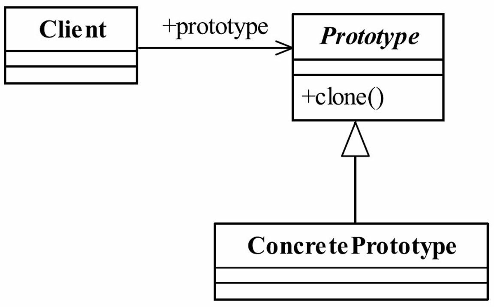

# 22.原型模式

## 原型模式的定义
原型模式（Prototype Pattern）的简单程度仅次于单例模式和迭代器模式。正是由于简单，使用的场景才非常地多，其定义如下：
Specify the kinds of objects to create using a prototypical instance,and create new objects by copying this prototype.（用原型实例指定创建对象的种类，并且通过拷贝这些原型创建新的对象。）



## 实例

### `AdvTemplate.java`

```java
@Data
@AllArgsConstructor
public class AdvTemplate {
    private String subject;
    private String content;
}
```

### `Mail.java`

```java
@Data
public class Mail implements Cloneable{
    private String sender;
    private String receiver;
    private String appellation;
    private String subject;
    private String content;
    private String tail;
    //定义一个私有变量
    private ArrayList<String> arrayList = new ArrayList<String>();
    public Mail(AdvTemplate advTemplate) {
        System.out.println("构造函数被执行了");
        this.subject = advTemplate.getSubject();
        this.content = advTemplate.getContent();
    }

    @Override
    protected Mail clone()  {
        Mail mail=null;
        try {
            //浅拷贝
            mail= (Mail)super.clone();
            //深拷贝
            mail.arrayList= (ArrayList)this.arrayList.clone();
        } catch (CloneNotSupportedException e) {
            e.printStackTrace();
        }
        return mail;
    }

    public void setValue(String name) {
        arrayList.add(name);
    }
}
```

### 测试类`MailTest.java`

```java
public class MailTest {
    public static void main(String[] args) {
        long a = RandomUtils.nextLong(1, 12);
        String sender = getRandomStr(3);
        String appellation = getRandomStr(3);
        AdvTemplate advTemplate = new AdvTemplate(appellation + "先生（女士）" + a + "月份信息卡账单", "国庆抽奖活动通知：只要刷卡就送你一百万");
        Mail mail = new Mail(advTemplate);
        mail.setSender(sender + "@" + getRandomStr(3) + ".com");
        mail.setTail("国庆后，打5折！");
        mail.setValue("张三");
        for (int i = 0; i < 3; i++) {
            Mail cloneMail = mail.clone();
            cloneMail.setValue("李四");
            cloneMail.setAppellation(appellation);
            String receiver = appellation + "@" + getRandomStr(3) + ".com";
            cloneMail.setReceiver(receiver);
            sendMail(cloneMail);
        }
    }

    private static void sendMail(Mail mail) {
        System.out.println(JSON.toJSONString(mail, true));
    }

    public static String getRandomStr(long len) {
        String seed = "abcdefghijklmnopqrstuvxyzABCDEFGHIJKLMNOPQRSTUVWXYZ0123456789";
        Random random = new Random();
        StringBuffer stringBuffer = new StringBuffer();
        for (int i = 0; i < len; i++) {
            stringBuffer.append(seed.charAt(random.nextInt(seed.length())));
        }
        return stringBuffer.toString();
    }
}
```

输出

```cmd
构造函数被执行了
{
	"appellation":"Ptd",
	"arrayList":[
		"张三",
		"李四"
	],
	"content":"国庆抽奖活动通知：只要刷卡就送你一百万",
	"receiver":"Ptd@fLS.com",
	"sender":"j5G@NmS.com",
	"subject":"Ptd先生（女士）8月份信息卡账单",
	"tail":"国庆后，打5折！"
}
{
	"appellation":"Ptd",
	"arrayList":[
		"张三",
		"李四"
	],
	"content":"国庆抽奖活动通知：只要刷卡就送你一百万",
	"receiver":"Ptd@Zjl.com",
	"sender":"j5G@NmS.com",
	"subject":"Ptd先生（女士）8月份信息卡账单",
	"tail":"国庆后，打5折！"
}
{
	"appellation":"Ptd",
	"arrayList":[
		"张三",
		"李四"
	],
	"content":"国庆抽奖活动通知：只要刷卡就送你一百万",
	"receiver":"Ptd@t1S.com",
	"sender":"j5G@NmS.com",
	"subject":"Ptd先生（女士）8月份信息卡账单",
	"tail":"国庆后，打5折！"
}
```

## 原型模式的应用

### 原型模式的优点
● 性能优良
原型模式是在内存二进制流的拷贝，要比直接new一个对象性能好很多，特别是要在一个循环体内产生大量的对象时，原型模式可以更好地体现其优点。
● 逃避构造函数的约束
这既是它的优点也是缺点，直接在内存中拷贝，构造函数是不会执行的。优点就是减少了约束，缺点也是减少了约束，需要大家在实际应用时考虑。

 ## 原型模式的使用场景
● 资源优化场景
类初始化需要消化非常多的资源，这个资源包括数据、硬件资源等。
● 性能和安全要求的场景
通过new产生一个对象需要非常繁琐的数据准备或访问权限，则可以使用原型模式。
● 一个对象多个修改者的场景
一个对象需要提供给其他对象访问，而且各个调用者可能都需要修改其值时，可以考虑使用原型模式拷贝多个对象供调用者使用。
在实际项目中，原型模式很少单独出现，一般是和工厂方法模式一起出现，通过clone的方法创建一个对象，然后由工厂方法提供给调用者。原型模式已经与Java融为一体，大家可以随手拿来使用。

## 注意事项

1. 使用原型模式复制对象不会调用类的构造方法。所以，单例模式与原型模式是冲突的，在使用时要特别注意。

2. Object类的clone方法只会拷贝对象中的基本的数据类型，对于数组、容器对象、引用对象都不会拷贝，这就是浅拷贝。如果要实现深拷贝，必须将原型模式中的数组、容器对象、引用对象等另行拷贝。

3. clone与final两个冤家
   对象的clone与对象内的final关键字是有冲突的

> 注意: 要使用clone方法，类的成员变量上不要增加final关键字