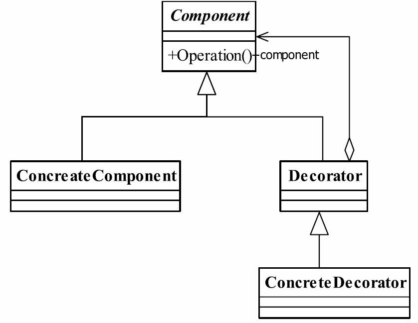

# 3.装饰模式
装饰模式（Decorator Pattern）是一种比较常见的模式，其定义如下：Attach additional responsibilities to an object dynamically keeping the same interface.Decorators provide a flexible alternative to subclassing for extending functionality.（动态地给一个对象添加一些额外的职责。就增加功能来说，装饰模式相比生成子类更为灵活。）



四个角色需要说明：
● Component抽象构件
Component是一个接口或者是抽象类，就是定义我们最核心的对象，也就是最原始的对象。

> 在装饰模式中，必然有一个最基本、最核心、最原始的接口或抽象类充当Component抽象构件。

● ConcreteComponent 具体构件
ConcreteComponent是最核心、最原始、最基本的接口或抽象类的实现，你要装饰的就是它。
● Decorator装饰角色
一般是一个抽象类，做什么用呢？实现接口或者抽象方法，它里面可不一定有抽象的方法呀，在它的属性里必然有一个private变量指向Component抽象构件。
● 具体装饰角色
ConcreteDecoratorA和ConcreteDecoratorB是两个具体的装饰类，你要把你最核心的、最原始的、最基本的东西装饰成其他东西。

## Component抽象构件`SchoolReport.java`

```java
public interface SchoolReport {
    /**
     * 家长看成绩单
     */
    void report();

    /**
     * 家长签名
     * @param name
     */
    void sign(String name);
}
```

## ConcreteComponent 具体构件`TomSchoolReport.java`

```java
public class TomSchoolReport implements SchoolReport {
    @Override
    public void report() {
        System.out.println("TOM成绩为 语文 20 数学 75 外语 85");
    }

    @Override
    public void sign(String name) {
        System.out.println("家长签名："+name);
    }
}
```

## Decorator装饰角色`SchoolReportDecorator.java`

```java
public abstract class SchoolReportDecorator implements SchoolReport {
    private SchoolReport schoolReport;

    public SchoolReportDecorator(SchoolReport schoolReport) {
        this.schoolReport = schoolReport;
    }

    @Override
    public void report() {
        schoolReport.report();
    }

    @Override
    public void sign(String name) {
        schoolReport.sign(name);
    }
}
```

## 具体装饰角色

`HighScoreDecorator.java`

```java
public class HighScoreDecorator extends SchoolReportDecorator {
    public HighScoreDecorator(SchoolReport schoolReport) {
        super(schoolReport);
    }

    @Override
    public void report() {
        System.out.println("班上最高分 语文 25 数学 79 外语 85");
        super.report();
    }
}
```

`RankingDecorator.java`

```java
public class RankingDecorator extends SchoolReportDecorator {
    public RankingDecorator(SchoolReport schoolReport) {
        super(schoolReport);
    }

    @Override
    public void report() {
        super.report();
        System.out.println("总体排名还不错 第15名");
    }
}
```

## 装饰模式应用
### 装饰模式的优点
● 装饰类和被装饰类可以独立发展，而不会相互耦合。换句话说，Component类无须知道Decorator类，Decorator类是从外部来扩展Component类的功能，而Decorator也不用知道具体的构件。
● 装饰模式是继承关系的一个替代方案。我们看装饰类Decorator，不管装饰多少层，返回的对象还是Component，实现的还是is-a的关系。
● 装饰模式可以动态地扩展一个实现类的功能，这不需要多说，装饰模式的定义就是如此。

### 装饰模式的缺点
对于装饰模式记住一点就足够了：多层的装饰是比较复杂的。为什么会复杂呢？你想想看，就像剥洋葱一样，你剥到了最后才发现是最里层的装饰出现了问题，想象一下工作量吧，因此，尽量减少装饰类的数量，以便降低系统的复杂度。

## 装饰模式的使用场景
● 需要扩展一个类的功能，或给一个类增加附加功能。
● 需要动态地给一个对象增加功能，这些功能可以再动态地撤销。
● 需要为一批的兄弟类进行改装或加装功能，当然是首选装饰模式。